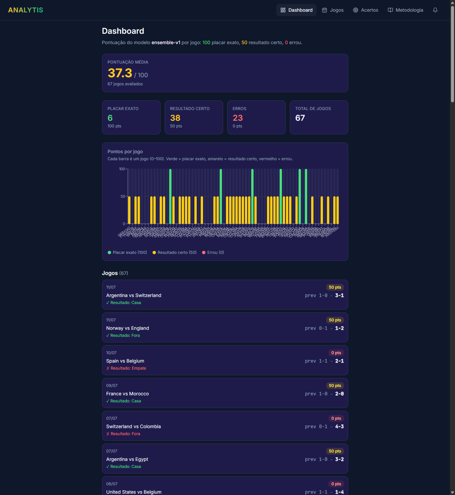
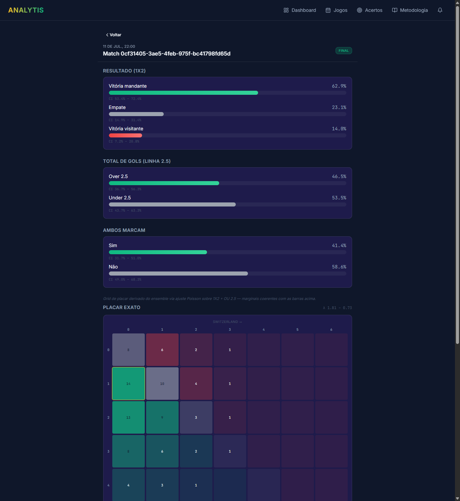
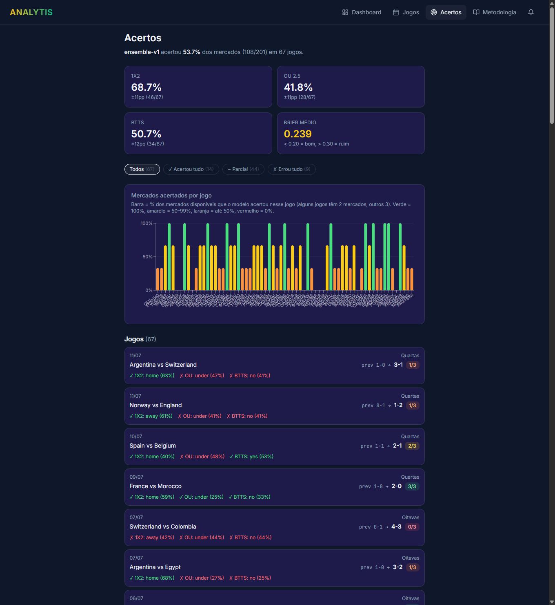

<div align="center">

# ⚽ analytis

**Previsões probabilísticas pré-jogo para futebol** — 1X2, Over/Under 2.5 e BTTS — com descoberta de _value bets_ comparando as probabilidades do modelo às odds ao vivo das casas, _staking_ por **Kelly fracionário** e rastreamento de **Closing Line Value (CLV)**. Backend em FastAPI + modelos (Dixon-Coles / XGBoost / ensemble) e um frontend PWA em React.

[](https://github.com/dariokrugerjunior/analytis/actions/workflows/ci.yml)
[](https://github.com/dariokrugerjunior/analytis/actions/workflows/deploy.yml)
[](https://analytis.zyntra.company)


🌐 **[analytis.zyntra.company](https://analytis.zyntra.company)**

</div>

---

## 📸 Screenshots

### Dashboard — pontuação por jogo
Cada partida finalizada vale **100** (placar exato), **50** (acertou o resultado, placar diferente) ou **0** (errou o resultado). O gráfico e os KPIs resumem a performance do modelo.



<table>
<tr>
<td width="50%">

**Detalhe da partida** — 1X2 / OU / BTTS (com intervalos de confiança) + heatmap de placar exato



</td>
<td width="50%">

**Acertos** — KPIs de acurácia por mercado, Brier score e acertos por jogo



</td>
</tr>
</table>

---

## ✨ Funcionalidades

**Modelagem & apostas**
- Previsões probabilísticas **1X2**, **Over/Under 2.5 gols** e **BTTS**.
- **Dixon-Coles** (fitter L-BFGS com _shrinkage_ por confederação) + **XGBoost** (classificador + regressor) + **ensemble** por _stacking_.
- **Calibração isotônica** e **intervalos de confiança** via bootstrap.
- Grid de **placar exato** derivado do ensemble (Poisson independente coerente com as marginais 1X2 + OU 2.5).
- **Value bets**: matemática de EV comparando probabilidade do modelo × odds de mercado, **Kelly fracionário** com _cap_ de stake.
- **CLV tracker**: registra a linha de fechamento e mede o _edge_ de fechamento — a única medida honesta de skill.
- **Walk-forward backtest** para validação temporal.

**Frontend (PWA)**
- **Dashboard** inicial com gráfico de pontuação por jogo (100 / 50 / 0).
- **Jogos** — próximas partidas com previsões sob demanda.
- **Detalhe da partida** — barras 1X2 / OU / BTTS + _heatmap_ de placar.
- **Acertos** — KPIs de acurácia por mercado, Brier score e crédito de placar, por modelo.
- **Metodologia** — explicação do pipeline.
- **PWA instalável** com **notificações Web Push** (VAPID).

**Infra & operação**
- **Auto-ingest scheduler** — coleta fixtures/odds automaticamente perto do kickoff.
- API HTTP **pública** (sem autenticação) servida junto ao frontend estático.
- Deploy contínuo para **Oracle Cloud (OCI)** via GitHub Actions.

## 🧱 Stack

| Camada | Tecnologias |
|---|---|
| **Backend** | Python 3.12, FastAPI, SQLAlchemy (async), Pydantic v2, APScheduler, structlog |
| **Modelos** | scikit-learn, XGBoost, scipy, numpy |
| **Frontend** | React 19, TypeScript, Vite, Tailwind CSS, shadcn/ui, TanStack Query, React Router, Recharts |
| **Dados** | PostgreSQL 16, Alembic (migrations) |
| **Infra** | Docker + Docker Compose, nginx + certbot (TLS), Oracle Cloud (OCI), GitHub Actions |
| **Fontes** | Football-Data.org, The Odds API, ELO ratings (eloratings.net), martj42 international results |

## 📦 Requisitos

- Python 3.12+ e [uv](https://docs.astral.sh/uv/)
- Node.js 20+ (frontend)
- Docker Desktop (Postgres)
- Token gratuito da [Football-Data.org](https://www.football-data.org/) (fixtures + resultados)
- Token gratuito da [The Odds API](https://the-odds-api.com/) (~500 req/mês, odds de casas)

## 🚀 Setup

**Backend**
```bash
git clone https://github.com/dariokrugerjunior/analytis.git && cd analytis
uv sync
cp .env.example .env
# edite .env: ANALYTIS_FOOTBALL_DATA_API_KEY e ANALYTIS_THE_ODDS_API_KEY

docker compose up -d postgres
uv run analytis db migrate
```
> Postgres fica na porta **5434** do host (evita conflito com Postgres instalado no Windows).

**Frontend**
```bash
cd frontend
npm install
npm run dev            # servidor de desenvolvimento (Vite)
# ou build de produção:
npm run build
```
Alternativamente, `uv run analytis frontend build` integra o build ao backend (servido em `/`).

## 🔄 Workflow ponta a ponta (CLI)

```bash
# 1. Ingerir fixtures da Copa 2026 (Football-Data.org)
uv run analytis ingest fixtures --competition 2000 --season 2026

# 2. Ingerir histórico internacional (martj42 CSV — grátis, ~45k partidas)
uv run analytis ingest history --tournament "FIFA World Cup" --since 2010-01-01

# 3. Treinar Dixon-Coles
uv run analytis train dixon-coles --since 2014-01-01 --name dc-wc-v0.2.0-no-decay --decay-per-day 0.0

# 4. Pontuar todas as próximas partidas
uv run analytis score all-upcoming --model dc-wc-v0.2.0-no-decay

# 5. Ingerir odds atuais (The Odds API)
uv run analytis odds fetch

# 6. Encontrar apostas +EV para uma partida
uv run analytis bets find-value --match-id <uuid> --model dc-wc-v0.2.0-no-decay \
    --min-edge 0.03 --bankroll 1000 --fraction 0.25 --max-units 50

# 7. Após o movimento da linha, re-coletar odds e rastrear CLV
uv run analytis odds fetch
uv run analytis bets track-clv --match-id <uuid>

# 8. (Opcional) Treinar XGBoost a partir dos feature snapshots
uv run analytis train xgboost --since 2014-01-01 --name xgb-wc-v0.1.0 --market 1x2

# 9. Backtest walk-forward
uv run analytis backtest run --since 2014-01-01 --min-train-size 128 --test-size 32 --decay-per-day 0.0
```

Subcomandos do CLI: `db`, `api`, `ingest`, `train`, `score`, `odds`, `backtest`, `bets`, `push`, `frontend`.

## 🌐 API HTTP

```bash
uv run analytis api serve --port 8000
```

Todos os endpoints são **públicos** (sem `X-API-Key`).

| Método | Rota | Descrição |
|---|---|---|
| `GET` | `/v1/health` | Health check |
| `GET` | `/v1/matches?upcoming=true&days=N` | Próximas partidas |
| `GET` | `/v1/matches/{id}/predictions` | Previsões 1X2 / OU / BTTS |
| `GET` | `/v1/matches/{id}/scoreline-grid` | Grid de placar exato (ensemble) |
| `GET` | `/v1/matches/{id}/odds` | Melhores odds por resultado |
| `GET` | `/v1/matches/{id}/value-bets` | Value bets persistidas |
| `GET` | `/v1/models` | Modelos treinados |
| `GET` | `/v1/bets/clv-summary` | CLV agregado por modelo |
| `GET` | `/v1/bets/clv-timeline?model=<nome>` | Série temporal de CLV |
| `GET` | `/v1/accuracy/summary?model=<nome>` | KPIs de acurácia |
| `GET` | `/v1/dashboard/scores?model=<nome>` | Pontuação por jogo (100 / 50 / 0) |
| `GET` | `/v1/push/vapid-public-key` | Chave pública VAPID |
| `POST` | `/v1/push/subscribe` | Registrar subscription de Web Push |

## ☁️ Deploy

Push para `main` dispara o workflow **[deploy](.github/workflows/deploy.yml)** (GitHub Actions), que faz build local da imagem, envia por `scp`/`load` para a VM Oracle Cloud e sobe via Docker Compose (nginx + certbot para TLS). Detalhes em [`docs/deploy-oracle-cloud.md`](docs/deploy-oracle-cloud.md).

## 🧪 Testes & qualidade

```bash
# Backend
uv run pytest                          # todos os testes
uv run pytest -m "not integration"     # unit (sem docker)
uv run pytest -m integration -v        # integração (testcontainers)
uv run ruff check . && uv run ruff format --check .
uv run mypy src tests
uv run pre-commit run --all-files

# Frontend
cd frontend
npm run typecheck
npm run test                           # vitest
```

## 🗂️ Layout

```
analytis/
├── src/analytis/
│   ├── config.py            # Pydantic Settings (env-driven)
│   ├── domain/              # entidades Pydantic
│   ├── persistence/         # SQLAlchemy ORM + repositories
│   ├── ingestion/           # adapters (Football-Data, ELO, martj42, The Odds API)
│   ├── features/            # registry, elo, strength, form, context, builder
│   ├── modeling/            # Dixon-Coles, XGBoost, ensemble, isotonic, bootstrap, EV, Kelly
│   ├── application/         # use cases (ingest, train, score, backtest, value bets, CLV, accuracy, dashboard)
│   ├── api/                 # rotas FastAPI + auto-ingest scheduler
│   └── cli/                 # subcomandos Typer
├── frontend/                # React + TS + Vite (PWA)
│   └── src/{pages,components,hooks,lib}
├── migrations/              # Alembic
├── deploy/                  # Docker Compose de produção, nginx, finish.sh
└── tests/{unit,integration}
```

## ⚠️ Avisos honestos (leia antes de apostar)

- **O Dixon-Coles atual é superconfiante.** Treinado em ~200 partidas de Copa, tende a produzir _edges_ de 50–90% em resultados de nicho — provável erro de modelo, não _mispricing_ de mercado.
- **CLV é a única medida honesta de skill.** Um edge no papel não vale nada até você ingerir as odds de fechamento e `analytis bets track-clv` reportar `closing_clv >= 0` sobre centenas de apostas.
- **Pinnacle não está no tier gratuito da The Odds API.** Comparar com casas secundárias (Smarkets, Betfair Exchange) informa menos que comparar com a linha mais afiada.
- **Aposte conservador.** Use **quarter Kelly** (padrão) ou stakes fixos minúsculos até acumular ≥200 apostas com CLV positivo.
- **Isto é uma ferramenta, não um tipster.** O sistema mostra o que o modelo pensa; a decisão de apostar é sua.

## 📄 Licença

Proprietária — ver o dono do projeto.
